# User Guide  
* Will be replaced with the ToC, excluding the "Contents" header
{:toc}  

[Back to documentation](index.html)

Marxan Web is a decision-support platform for doing Systematic Conservation Planning over the web and for sharing the results amongst stakeholders and the conservation community. It builds upon the existing Marxan software and offers the following new features and benefits:  

- Streamlined access to spatial data layers from our partners 
- Training and demonstration tutorials (in development)
- Built in geoprocessing and file construction
- Improved mapping and visualization capabilities
- Sharing and learning with other users

For more information about migrating from the existing version of Marxan see the [Migration Guide](migration.html)

## The Marxan User Interface
The section provides a brief overview of the main elements in the Marxan User Interface and introduces some of the terminology in use. For more detailed information visit the individual sections further on.  

### Log in window
When Marxan Web is first loaded the login screen is presented as shown in the image below. The login screen allows you to select a Marxan Server and to login to that server. It also allows you to register as a new user. For more information see [New User Registration](#new-user-registration).  

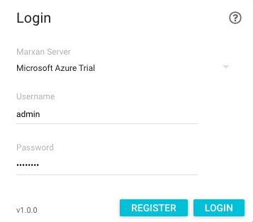

Marxan Servers are the public and private hosted instances of the Marxan Server database in different organisations around the world and they also include instances that are running on a local machine (shown as localhost). A Marxan Server database contains the projects, features and planning grids that are managed by that organisation and that are relevant to their own users. Users can connect to these servers to view those projects that have been created in those organisations. In addition, if those organisations have granted access, these projects can be edited and run by those users. The list of servers comes from a central database (called the Marxan Registry) and any organisation can be added to this list.  

Hovering over a server shows a brief description of that server and the domain on which it is hosted. An icon to the left of the name shows the current status of that server according to the following symbols:  
- \<no symbol\> Read/write - projects can be viewed and edited (by users with those permissions)
-  Read only - project can be viewed only (by the guest user)
-  Server currently offline - no connection is possible. This could be due to a number of reasons including: the server could be down or the network connection may have been lost.  

Once a server has been selected, the user must enter their credentials to login to that server. The user will be logged in according to their role: read-only user, normal user or admin user. Each of these roles have a different set of functions that they have access to in the application with admin users having access to all functions. All of the screen shots in the following sections show the application as an admin user and hence not all elements may be visible if logged in as a different user. For more information see [Roles](#roles).

Once you are logged in you will see the Marxan User Interface. This comprises four main elements which are part of a single page web application: the map, the project window (on the left), the results window (on the right) and the toolbar. Other windows are shown as and when they are required. This single page will remain the main user interface until logging out and all tasks are completed in this interface.  

### Project window
On the left hand side of the application user interface is the project window which comprises three tabs: the project tab, the features tab and the planning units tab. These tabs taken together represent the inputs to the analysis: which project, which features are part of that project and what planning units will be used. For more information on projects see the [Projects](#projects) section.  

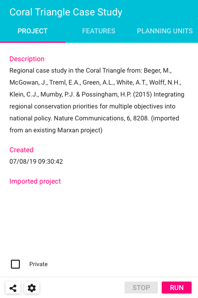

At the bottom of the project window is a toolbar for working with the project. There are buttons to start, stop and configure Marxan Runs and also a button to get a shareable url to the project (projects are only shareable if they are running on a hosted Marxan server). This link can be shared with anyone and will open the project (as a guest user) with no requirement to login first.  

### Results window
On the right hand side of the user interface is the results window which also comprises three tabs: the legend tab, the solutions tab and the log tab. These tabs taken together represent the outputs of the Marxan analysis and allow the user to change what results are shown and how they are visualised. For more information on project outputs see the [Running projects](#running-projects) section.  

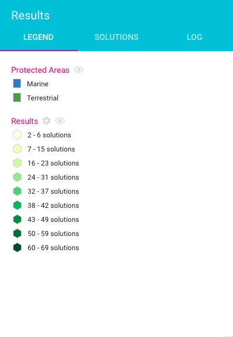

### The Map
The main part of the application user interface is taken up by the interactive map. The map is the main way of visualising the outputs from any Marxan analyses and is a powerful and flexible tool for visualising hundreds of thousands of individual planning units on-the-fly in three dimensions. The map can be zoomed, panned, rotated and tilted to find the best viewing perspective for a particular run. For more information see the [Mapping](#mapping) section.  

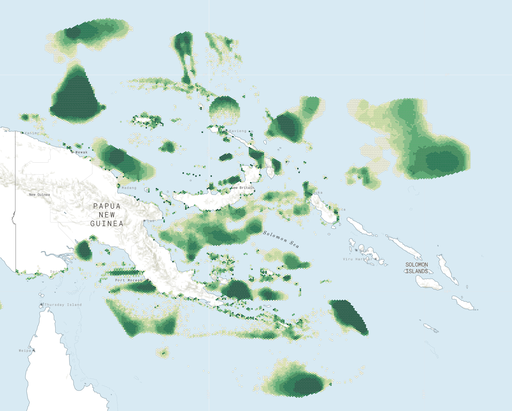

### Toolbar
At the centre top of the user interface is the main toolbar which includes a number of sections:
- The name of the Marxan Server that the user is currently connected to. Click this name for more details of the Marxan Server (see [Server Details](#server-details))
- A menu for the user (see [The User Menu](#the-user-menu))
- Buttons for opening the project, feature and planning grid windows 
- Buttons for showing/hiding the project and results windows
- A menu for the tools and analyses of Marxan Web (see [Tools and Analysis](#tools-and-analyses))  
- A menu for the help documentation (see [Help](#help))

## Projects
### Understanding projects
Projects are the main way of organising Marxan Web analyses and are the starting point for new conservation planning activities. Each project contains a set of planning units which represent the geographic domain over which the analysis will be done; a set of spatial features to be considered in the analysis (e.g habitats, cultural sites, species distributions, ecological processes); and a set of parameters that are used to fine-tune the analysis. A project also has a limited set of metadata including the project name, a description and the date that it was created. Users with read/write permissions can create any number of projects which are limited only by the amount of disk storage on the server machine.  

#### Types of project
Marxan Web projects can be created from scratch using the New Project wizard, or they can be imported from previous Marxan projects. Both types of projects can be run and visualised in the map, but imported projects have less capabilities than new projects. The preferred method of creating projects is to create them using the New Project wizard where possible. The main difference is that features cannot be added or removed in imported projects and those features cannot be visualised on the map.  

### The projects window
The projects window is the main way you manage projects on a server and depending on your user role you can manage your own projects or everybodys projects. The projects window lists the projects on the server together with their metadata including the user, project name, description and creation date (the actual columns that are shown will depend on the user role). The view of projects can be sorted by any of the columns by clicking on the column header to sort in ascending or descending order. In addition, at the top of the window is a filter box that allows you to filter the items by matching or non-matching text (in common with the features and planning grid windows as well). For more information on filtering items, see [Filtering Items](#filtering-items). At the bottom of the window is a toolbar that contains the common tasks associated with managing projects - the actual buttons that are shown will depend on the user role. The functioning of these buttons is described in the following sections. 

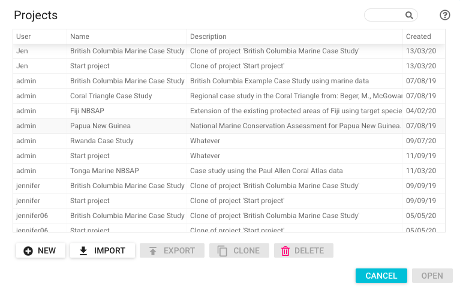

### Included case studies
In a default installation of Marxan Web, there are a number of pre-loaded case studies that will be shown in the projects window. These have been created to help you get up and running quickly by providing examples and specific tutorials for working through real-world conservation planning scenarios.  

### Managing projects
This section contains information on the common tasks associated with managing projects.  

#### Creating new projects
The preferred way to create new projects in Marxan Web is to create them with the New Project wizard. This wizard takes the user through a simple set of steps to create a fully functioning Marxan Web project. The user creates the project metadata; selects the conservation features that will be included in the project and chooses the planning grid that will form the geographic extend and resolution for the analysis.  
  
To create a new project using the New Project wizard:  
- Click on the New button in the projects window

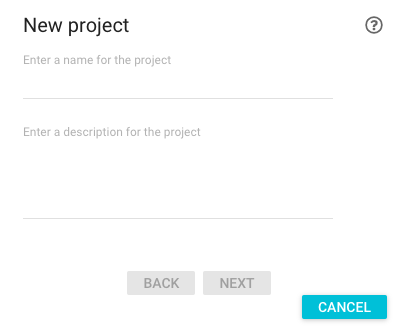

- Enter the project metadata and click Next
- Choose a planning grid from the drop down list - when you choose an item the map zooms to the extend of the grid and shows the planning units. If the required planning grid is not shown, then it can be created in from the Planning Grids window (see the [Planning Grids](#planning-grids) section) and then the wizard can be restarted. Click Next

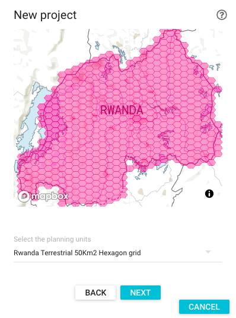

- Choose the conservation features that will be part of your project and click Finish  

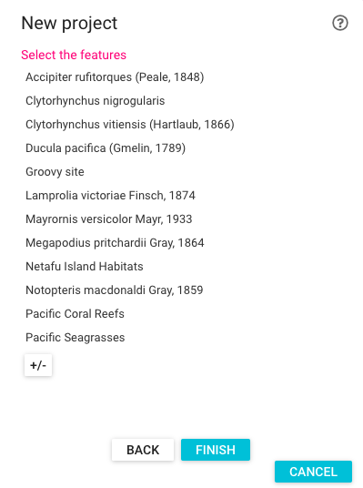

The project will now be created and opened and can be run immediately.  

#### Importing Marxan Web projects
Projects exported from Marxan Web as .mxw files can be imported using the Import Marxan Web project window. 

To import a Marxan Web project:
- Click on the Import button in the Projects window and select from Marxan Web
- In the Import from Marxan Web window, select the .mxw file

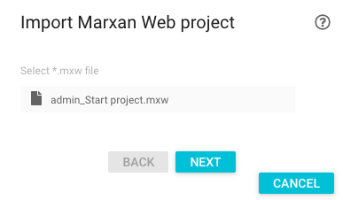

- Click Next and enter the project metadata

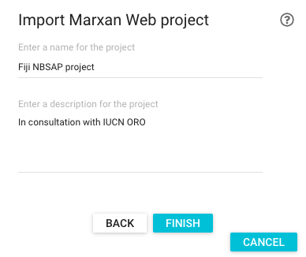

- Click Finish.  

The project will now be imported and any individual features or planning grids that do not yet exist on the Marxan Server instance will be created. Once this process has finished the imported Marxan Web project will be shown in the project window and can be run immediately.  

#### Importing Marxan DOS projects
Existing Marxan DOS projects can be imported to Marxan Web using the Import existing Marxan project window (currently only supported on Google Chrome). Imported projects do not have the same functionality of Marxan Web projects (i.e. created with the New Project wizard or imported from mxw files). There are a number of important differences, in particular, the following capabilities are not supported on imported projects: 

- Project features cannot be added or removed
- Showing the project features on the map 
- Zooming to project features on the map 
- Project features have only basic metadata, e.g. simple names and no descriptions  
  
To import a DOS-based Marxan project:  
- Click on the Import button in the Projects window and select from Marxan DOS
- Specify the Marxan Project Folder which should point to the folder that contains the input.dat file
- Zip up the planning grid shapefile that was used in the DOS-based Marxan project - this shapefile must have a field called 'puid' which is the unique value for the planning unit. All of the individual files that make up a shapefile should be included (e.g. shp, shx, dbf etc.). Do not include any relative or absolute paths or any other files.  
- Upload the zipped shapefile
- Specify the name of the planning grid - this will be the name of the planning grid that is created from the zipped up shapefile

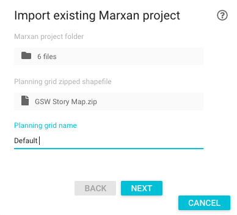

- Click Next and enter the project metadata

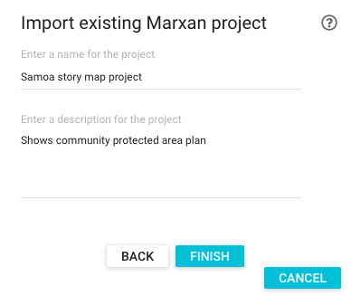

- Click Finish.  

The project will now be imported and the shapefile will be uploaded to Mapbox (for more information see [Understanding mapping](#understanding-mapping)). Once this process has finished the new Marxan Web project will be shown in the project window with the text 'Imported Project' at the bottom. The project can be run immediately.  

#### Duplicating a project
Duplicating a project copies all of the project information to start a new project with the same project name but with a '_copy' suffix. The project can then be opened, edited and run. This provides a mechanism for iterating projects, scenario planning and parameter testing.

#### Exporting a project
Marxan Web projects can be exported to a file which contains all of the features, planning grid and run settings for the project. This file can then be imported to any Marxan Server instance and thereby provides an exchange format for projects (see [Importing Marxan Web projects](#importing-marxan-web-projects). This could be useful, for example, where a user has worked on a project on their local machine (where it is private), and then they want to share it to a wider community - exporting to a .mxw file and then importing on a publically hosted Marxan Server allows them to do this.  

#### Deleting a project
To delete a project, select a project and click on the delete button. Deleting a project will not delete any features or planning grids. Admin users have the ability to delete projects belonging to any user.  

#### Controlling access to a project
By default projects are created as public which means that they can be viewed by any other Marxan user. In order to restrict access to the project, it can be flagged as private and it will then only be visible to the project author. To set a project as private (the default value), in the project tab select the check box marked private at the bottom of the window.  

#### Editing project metadata
To edit the name or description for a project, simply click on the name or description in the project tab and then edit it. When you are finished press ENTER. The description can be entered as HTML so that hyperlinks to web resources can be embedded.     


### Managing features within a project
The features that are included in a project are shown in the features tab and for each feature there is a target icon (on the left), a status bar (underneath the feature name) and a context menu (on the right).  

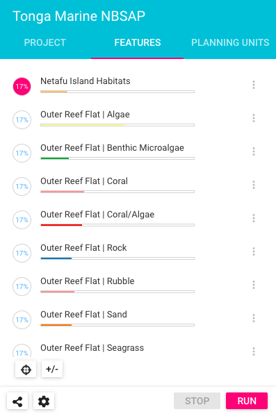

The target icon shows the target that has been set for that particular feature and its color reflects the status of the features target. If the project has been run and the target has been achieved for the feature then it is white. If the target has not been achieved it is shown in pink.  

The status bar shows a scale from 0 to 100% which reflects the percentage of the target acheived (in colour) relative to the amount set (in grey). If there is a target shortfall for a feature, the target icon will be pink.  

The context menu provides a set of functions that apply to the feature and the functions available depends on whether the project is a Marxan Web project or imported from Marxan DOS and also on whether the feature was uploaded to Mapbox as a shapefile (see the [Uploading spatial data to Mapbox](#uploading-spatial-data-to-mapbox) section).  

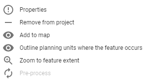

The following list is the full set of functions that are available in the context menu:  
- Properties - this opens the Feature Properties window - for more information see [Feature Properties window](#feature-properties-window).  
- Remove from project - this is a shortcut to remove that feature from the project.  
- Add to map - the features geometry will be added to the map as a polygon
- Outline planning units where the feature occurs - this shows those planning units which intersect the feature's distribution. 
- Zoom to feature extent - zooms the map to the extent of the feature's geometry.  
- Preprocess - intersects the feature with the planning grid which is a prerequisite for a Marxan run. For more information see [Preprocessing features](#preprocessing-features).  

#### Adding and removing features  
To add or remove features in a project click on the +/- button in the features tab and select which features you want to include in the project. Features that are included in the project will be listed in alphabetical order. Features can only be added or removed in projects that were created with the New Project Wizard and not for imported projects. For more information see [Why do imported projects have less functions available?](#why-do-imported-projects-have-less-functions-available).  

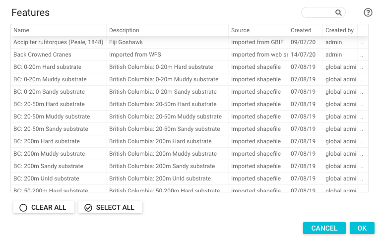

#### Viewing feature metadata  
In the context menu click Properties to view all of the feature metadata. For more information see [Feature Properties window](#feature-properties-window).  

#### Changing feature targets  
Individual feature targets can be changed in one of two ways:  
- In the features tab, double click on the target icon of the feature whos target you want to change, type the new target percent and press ENTER
- In the Feature Properties window, enter a new value in the Target Percent field and click OK  

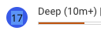

To change targets for all features, click on the target icon underneath the list of features and set a value.  

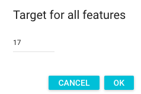

#### Changing feature penalty factor  
In the Feature Properties window, enter a new value in the Species Penalty Factor field and click OK.  

### Running projects
#### An overview of running projects
When you run a project in Marxan Web there are a number of discrete steps that take place. These are described in the following paragraphs.  

If you are running the project for the first time or you have added new features since the last time you ran it, then all of those features need to be preprocesssed. For more information see [Preprocessing features](#preprocessing-features). This is done automatically as part of the Marxan run. Depending on how many features are in the project, and the scale of the project, this may take some time. The state of that preprocessing is shown in the Log tab.  

Once feature preprocessing has been completed, Marxan computes the best combinations of planning units that meet the feature targets and minimises the total cost of the solution. The number of solutions generated can be set in the Run Settings window (see [Run settings](#run-settings)). By default any new project will have 10 iterations but we recommend changing this to at least 100 once the project is set up and the features have been processed. Runs can be stopped at any time using a number of methods. For more information see [Stopping runs](#stopping-runs).  

The state of the Marxan project's execution is shown in the Log tab (although this is currently not supported on Windows) and the Run number shows the status. There is a lot of additional information in the Log window which shows the statistics that have been produced by the Marxan algorithms. The state of a Marxan run is also shown in the Run log window. For more information see [the Run log](#the-run-log).

When the run completes succesfully, at the end of the run the results will be shown on the map and in the features tab. For more information see [Viewing and interpreting the results](#viewing-and-interpreting-the-results). If the run is stopped before it has finished then no results will be available and the results from the previous run (if available) will still be visible in the map and in the features tab.

#### Run settings
There are a large number of settings that can be changed for the Marxan run and these are edited in the Run Settings window which is accessed from the bottom of the main project window. Many of these settings are for experienced Marxan users that understand how the different values can affect the results, but there are some commonly used settings that are described in the next sections: the number of runs and the degree of clumping. For more information on all of the Marxan Run settings consult the Marxan User Manual available in pdf from [here](https://github.com/marxanweb/general/raw/master/marxan%20manual%201.8.10.pdf).  

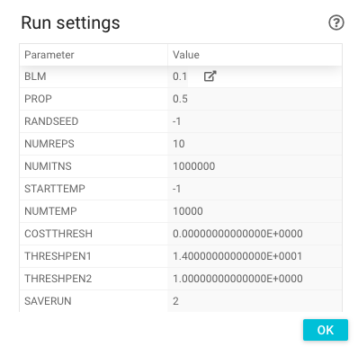

Settings which can be edited are shown in grey. To set a run parameter, click in the value column next to the corresponding parameter, enter a new value and click OK. The setting will be used the next time you run the project. The method to change the BLM parameter value is slightly different - for more information see [Clumping window](#clumping-window).  

##### Changing the number of runs
The number of runs tells Marxan how many times to find a good solution. The default setting for a new project is 10 to save time and processing power while a project is being created for the first time and you are trying to understand the impact of any changes in features, targets or costs. However, to comply with best practice, the number of runs should be set to at least 100 once you are satisfied the project reflects your objectives.  

##### Clumping window
The degree to which the planning units are grouped or clumped together is controlled by the BLM setting and this value is set using the Clumping window. To access the Clumping window, click on the icon in the value column for the BLM setting.  

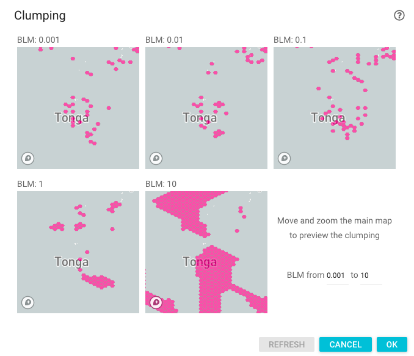

When the clumping window first opens for a project, Marxan Web will automatically run an analysis that calculates every shared boundary length in the planning unit layer. This tells Marxan which planning units are next to each other and enables the ability to start clumping results. The progress is shown in the Log tab. At the end of the process the clumping window will be enabled.  

This window provides an interactive way to set the degree of clumping by running the project 5 times using different clumping values and showing the results on 5 separate maps. To use a specific BLM value derived from this process, click on the map that best reflects the level of clumping you prefer or enter the value directly in the Run settings window. The default values for the clumping window are: 0.001, 0.01, 0.1, 1 and 10. These may not necessarily be the best values for the current project and it may be necessary to experiment with different value ranges. To change the range of BLM values in the clumping window, enter new values for the minimum and maximum and click the Refresh button. These values will be scaled over the 5 separate maps and a new set of results will be shown.

To change the scale and position of all of the 5 separate maps, move or zoom the map in the main window.  

#### Stopping runs
Project runs can be stopped at any point using one of the following methods:
- By clicking on the Stop button in the main project window
- By opening the Run Log window and clicking on the running project and clicking the Stop button (admin users only). For more information see [the Run Log](#the-run-log).

Marxan runs can also be stopped for other reasons - for more information see [the Run Log](#the-run-log).

#### Viewing and interpreting the results
Once Marxan has completed the specified number of runs, the results are shown on the map and in the Features tab. The map output can show either an individual run's solution or a summary of all solutions which are described in the following sections. The Features tab will show how much of each feature is met in the individual solution and whether the feature has reached its target or not. This is described in [Viewing targets](#viewing-targets)

##### Understanding solutions
The output of a single Marxan run is the collection of planning units required to meet the feature targets while minimising the total cost of the network. Each individual solution, when mapped, shows the distribution of planning units selected to be in the solution. For a more in depth discussion see, for example, [Marxan and Relatives: Software for Spatial Conservation Prioritization](https://www.researchgate.net/profile/Matthew_Watts/publication/43525654_Marxan_and_relatives_Software_for_spatial_conservation_prioritization/links/56ab3bcc08aeadd1bdcccc51.pdf).

##### Understanding the summary of solutions
The summary of all the solutions (also refered to as the "Selection Frequency") shows the number of times a planning unit was selected to be in the final solution, across all runs - this is the default output when you run Marxan Web. For example, if you set the number of runs to 100, the maximum value in the summed solutions will be 100. This output is the default result mapped once the analysis is completes and shows you the relative value of the planning units needed to meet the objectives. The mapping symbology for this layer can be changed by clicking on the layer symbology button. For more information see [Changing how the results are displayed](#changing-how-the-results-are-displayed).

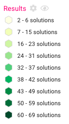

##### Solutions tab
The individual solutions and the summary of solutions are presented in tabular form in the Solutions tab. By default, at the end of a Marxan analysis, the summary of solutions is shown in the map and the sum row is selected in the table. Underneath the sum row, each one of the individual solutions are shown with information on the overall score, cost, number of planning units and the number, if any, of targets that have been missed for each run. To show an individual solution on the map, click on the relevant solution in the table. The table data can be sorted (like all tables in Marxan Web) by clicking on the column header to sort in ascending or descending order. This allows you to rank the solutions in order of score. The lowest scoring run is considered to be the 'best solution' and is often the prefered or baseline output of any single solution.  

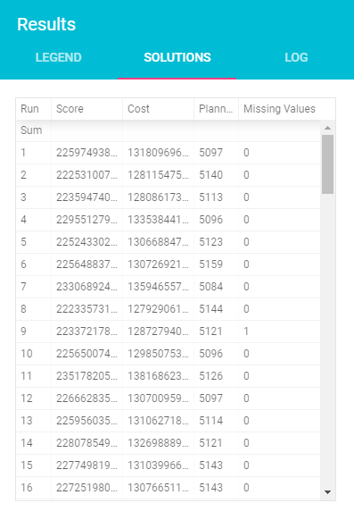

##### Viewing target achievement
Marxan also produces information on how much of each feature is captured in each solution and whether or not it has met its target. Targets are set in the Features tab - for more information see [Changing feature targets](#changing-feature-targets). To view information on which features have met their targets for an individual solution, select that solution in the Solutions tab - the features are updated in the Features tab - for more information on understanding feature targets and how they are visualised see [Managing features within a project](#managing-features-within-a-project). By default, at the end of a Marxan run the last solution is shown in the Features tab.  

#### The Log window
The purpose of the Log window is to provide realtime feedback on any processes that are running on the Marxan server. This is especially important for long-running processes (such as Marxan runs) where visual feedback is essential to know that something is still happening. The log window directly streams messages back from the Marxan server in realtime while the browser is connected (this is currently not supported on Windows). If the browser is closed or the connection is lost then the log will no longer update if the browser is reopened. In these cases processes on the server may still be running but there will be no realtime logging. To view the status of Marxan runs if you have disconnected you can use the Run log - for more information see [the Run log](#the-run-log).  

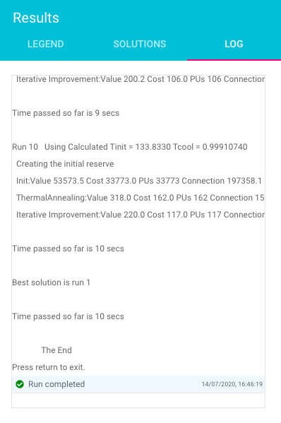

Whenever any preprocessing or Marxan runs are started, the log window is opened to show the progress and to show any errors, if they occur. This log can be copied to the clipboard (by clicking on the copy button at the bottom of the window) and cleared (by clicking on the erase button).  

#### The Run log
The Run log is used to view the status of any Marxan runs and to stop those runs where necessary (admin users only). The table shows a list of all of the Marxan runs and shows information on the process ID, user, project, start and end date, duration and the number of solutions completed and the number of solutions requested. The log updates automatically every 5 seconds.  

The status is set according to the following values:  
- Running - the run is currently running. This can also appear under exceptional circumstances either if the server crashes or is turned off during a run.  
- Stopped - the run was stopped by a user.  
- Killed - the run was killed by the operating system. This can happen if there are too many concurrent runs and the server runs out of memory.  

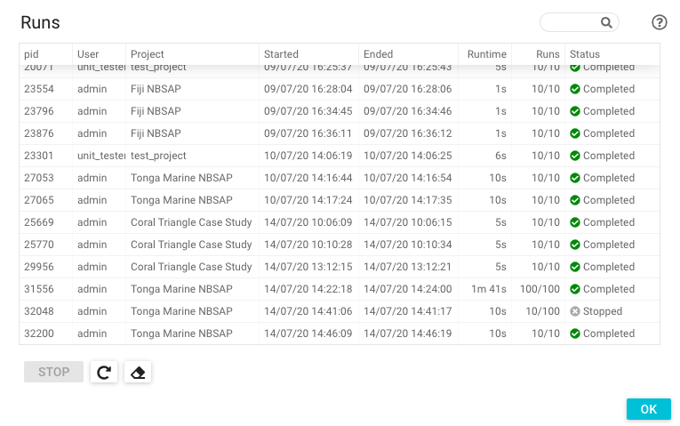

Projects that have started running will continue to run on the server until one of the following happens: they complete; they are explicitly stopped or if the server kills the process. If the browser window or tab is closed or the connection to the server is lost, the run will continue regardless. To check the progress of a run if you have lost the connection to the server, you can open the run log to see whether it has completed or not. If it has completed and you want to view the results then you can open the project from the Projects window. Only the results from the last successful run can be loaded, as each subsequent run overwrites the previous results in Marxan. If you want to save the results of previous runs then the best approach is to duplicate the project and then run it with a different name.  

Bear in mind that admin users have access to all of the runs that are currently running (for any user) and can stop runs using the Run Log window. To avoid this happening you can restrict access to particular projects by setting them as private. See [Controlling access to a project](#controlling-access-to-a-project).   

## Features
### Understanding features
Features in Marxan Web are those things that need to be protected and can range from biodiversity features, for example species or habitats, to ecosystem services, for example scenic areas or natural capital. All projects must contain one or more features and for each feature a target must be specified for the amount of that feature that must be protected (based on the geographic extent). For example, if a feature within a project is 'sea grass beds' and it has a total geographic area of 32Km2 within the planning grid and a target of 10%, then the total area of sea grass beds that must be protected is 3.2Km2.  

All features within the project initially carry the same weight - that is, all of them are considered equally in the Marxan run. This can be changed by changing the Species Penalty Factor. For more information see [Changing feature penalty factor](#changing-feature-penalty-factor).  

The source for these features can come from a range of different sources including local spatial data, global data providers or digitising them on the screen. One of the benefits of using Marxan Web is that any features that have been captured by the community can be shared between projects (if users have permissions).  

### The features window
The features window is used to show all of the features that are available on the server and it allows the user to manage those features. The list of features shows information on the name of the feature, a description, the date that it was created on and who it was created by. Features can be sorted either in ascending or descending order by clicking the column in the table. Features can also be filtered by matching on a text string (see [Filtering Items](#filtering-items). Hovering over the feature name will show the full unique system identifier for the feature and hovering over the description will show the full description if it cannot be read in the table. To view all of the details for an individual feature, click on the ellipsis button on the right hand side of the table to open the feature details window.  

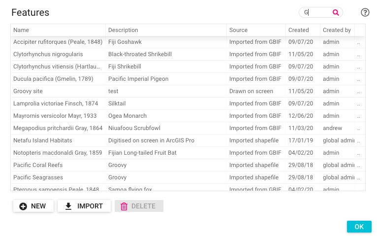

### The feature details window
The feature details window shows you all of the information for an individual feature and shows a preview of the feature on a map (if it has been uploaded to Mapbox). Additional internal information on the feature is available by clicking on the more.. link.  

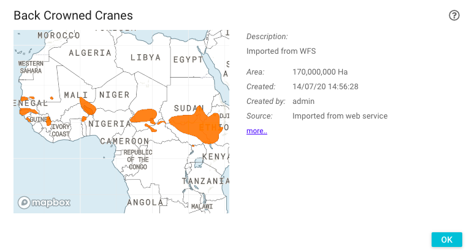

### Managing features
#### Creating new features
All users can create new features using a number of different methods which are described below. In each case the process ends with the feature being uploaded to Mapbox so that it can be visualised in the map. For more information see [Uploading spatial data to Mapbox](#uploading-spatial-data-to-mapbox). In all of the import/create feature windows there is the option to add the new feature to the current project.   

##### Importing from a shapefile
To upload existing spatial data from the local machine onto the server as new features use the import from shapefile window. This steps you through the process of imported single or multiple features.  

- Click on the Import button and select From a shapefile. 
- In the first step of the wizard, upload a zipped shapefile which contains the feature data that you want to import, then click next.  


- In the second step, choose whether you want to create a single feature or a set of features from the shapefile, then click next.  

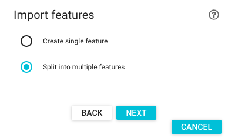

- The final step depends on what you chose in step 2. If you are importing a single feature, then you will have to enter a name for that feature and a description. If you are importing multiple features then choose the field in the shapefile that will be used to split the data into separate features.  

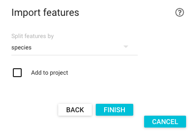

- Click finish to import the features from the shapefile. If the feature with the name specified already exists, then an error message will be shown at the bottom of the screen and the feature name will have to be updated.  

The only prerequisite for importing an existing feature is that the feature must have the necessary projection information file present - for more information see [Requirements for importing spatial data](#requirements-for-importing-spatial-data).

##### Importing from the web  
Features can also be imported from common web formats such as Web Feature Services. 

- Click on the Import button and select From the web. 
- In the first step of the wizard, select the type of web resource and click next.  

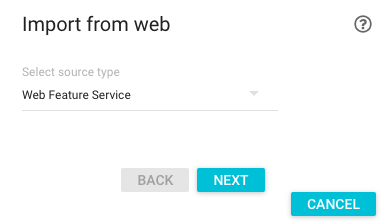

- In the next step, enter the endpoint of the Web Service. For Web Feature Services, paste in the url of the WFS GetCapabilities resource and click next. For example, the following WFS endpoint can be used to import Crane data [Harris <i>et al</i>, 2019](#references)):  

```
https://dservices2.arcgis.com/7p8XMQ9sy7kJZN4K/arcgis/services/Cranes_Species_Ranges/WFSServer?service=wfs&request=getcapabilities
```  

When the GetCapabilities resource has been loaded click next.  


- Select the feature type from the list of available feature types and click next.  

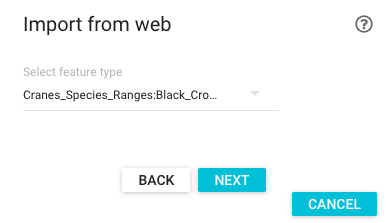

- Enter a name and description for the feature that will be created and click Finish.  

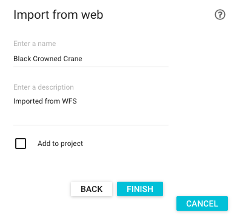

##### Importing from the Global Biodiversity Information Facility (GBIF)
Features can also be directly imported into Marxan Web from GBIF who provide species observation data through public, free and open Web Services. Currently GBIF hold more than 1 billion species occurrence records and although these records do not represent the extent of occurrence or area of occupancy for a species, they can be used in specific use cases where appropriate.

To import data from GBIF:
- Click on the Import button and select From the Global Biodiversity Information Facility.  
- Type at least 3 letters in the search box to find matching names from GBIF  

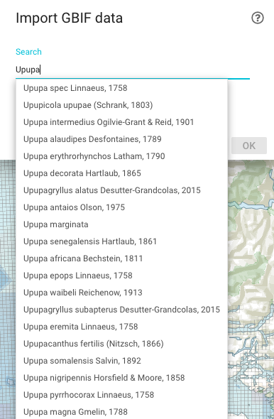

- Select a species and click OK

The GBIF occurrence records are imported as a single feature - currently all records are buffered to 100m from their original lat/lng value although this will change in a future version.  

##### Drawing features on screen
Another way to capture new features within Marxan Web is to digitise them directly on the map using the mouse. To do this:
- In the Features window click on New and Draw on screen   
- Draw the new feature on the map by clicking and drawing a polygon
- When you are finished double click to finish the polygon
- Enter the name and description in the dialog box and click OK  

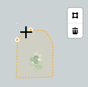

##### Adding features from the IUCN Red List of Threatened Species
Adding features from the IUCN Red List will be made available in future versions of Marxan Web and the workflow will be similar to that for GBIF data.  

#### Deleting features
Deleting features is only possible as an admin user and then only if the features are not in use in any projects and they are not system supplied. System supplied features are ones that are used in case studies and tutorials and therefore cannot be deleted. If the features are in use, then a window will list all of the projects where they are being used.  

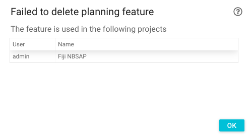

### Preprocessing features
In order for the features to be able to be used in Marxan, they have to be preprocessed by intersecting them with all of the planning units in the planning grid. This is necessary so that the algorithms know which features occur in which planning units. This process is done automatically in Marxan Web when a project is run for the first time, or if new features are added to a project. Once the preprocessing has started it cannot be stopped and once is has finished it does not need to be done again.  

### Feature properties window
The Feature properties window shows information about the feature including its metadata, its spatial statistics and its protection in the currently selected solution (if no individual solution is selected then the statistics will relate to the last solution by default). To show the feature properties window, click on Properties in the features context menu. For more information see [Managing features within a project](#managing-features-within-a-project). 

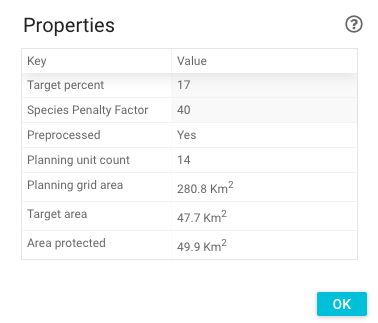

The information that is shown for a feature is summarised below. Note that not all of this information is shown for features in an imported Marxan project. For more information see [Why do imported projects have less functions available?](#why-do-imported-projects-have-less-functions-available)
- Target percent - the target percentage for the feature for the Marxan run. This can be edited in place by typing a value and pressing ENTER.  
- Species penalty factor - the weighting given to the feature. This can be edited in place by typing a value and pressing ENTER.
- Preprocessed - a flag to indicate if the feature has already been preprocessed (i.e. intersected with the planning grid). If the feature has already been preprocessed then there will be statistics for the planning unit count and area.
- Planning unit count - the total number of planning units which intersect the feature.
- Planning unit area - the total area of the feature in the planning grid (in square kilometers). 
- Target area - the area that needs to be protected to meet the target percentage for the feature (in square kilometers).
- Area protected - the total area of the feature protected in the current solution (in square kilometers). This is only available after a run has completed. If the area protected is less than the target area then this figure will be shown in red. In some cases the area protected may appear to be the same as the target area and yet the figure is shown in red. This is because of rounding issues in showing the figure in the table and if you hover over the area protected you will see the actual un-rounded area of the feature.  

### Showing features on the map
For new projects that have been created in Marxan Web, the features can be shown on the map as polygons.  Imported projects do not support showing feature polygons on the map - for more information see [Why do imported projects have less functions available?](#why-do-imported-projects-have-less-functions-available) To show a feature on a map, either click the feature name or click on the link in the features context menu. The feature being mapped is added to the map legend.    

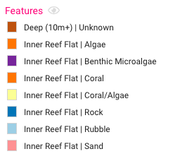

For all projects, the extent of the feature can also be mapped by either holding down ALT and clicking on the feature name or clicking 'Outline planning units where the feature occurs' in the context menu - this shows those planning units which intersect the features polygon. The feature being mapped is added to the map legend.  

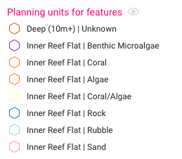

## Planning grids
### Understanding planning grids
Planning grids provide the geographic framework for the systematic conservation planning process. They define the geographic extent and the resolution of the individual planning units that make up the grid and it is this grid which forms the basis of the Marxan analysis. Within Marxan Web there are various tools for creating and managing planning grids and the size and type of planning grid used has an important bearing on the analysis and also on the real-world implementation of the new reserve system. 

### The planning grids window
The planning grids window provides information on the planning grids that are available on the server. The table shows the information on the name, description, when the grid was created and who created it. Planning grids can be filtered by matching on a text string (see [Filtering Items](#filtering-items). If you hover over the name you will also see the internal unique identifier for the planning grid. This is also the unique identifier for the dataset on Mapbox.  

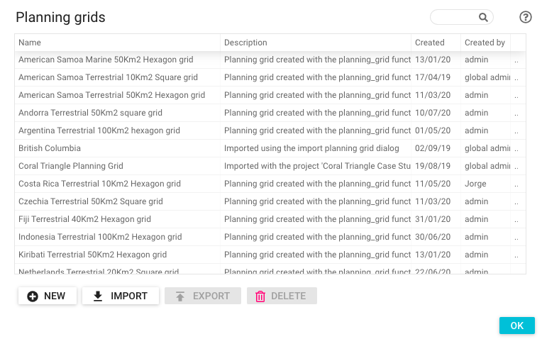

At the bottom of the planning grids window is a toolbar that allows you to manage planning grids. These tools are described in the following sections. To view more details on an individual planning grid, click on the ellipsis button on the right hand side of the table.  

### The planning grid details window
The planning grid details window shows you all of the information for an individual planning grid and shows a preview of the planning grid on a map. Additional internal information on the planning grid is available by clicking on the more.. link.  

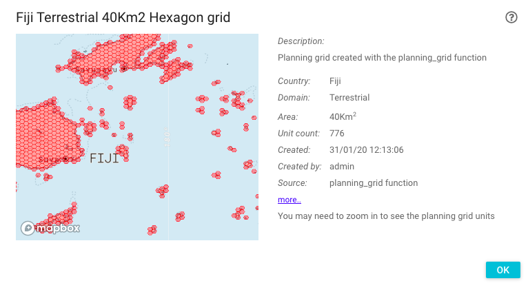

### Managing planning grids
Planning grids can be created, imported, exported and deleted using the tools in the planning grids window. Not all tools are available for all roles. For more information see [Roles](#roles).  

#### Creating planning grids
There are two basic types of planning grid: ones created in Marxan Web and ones created externally and imported from the local machine. Both of these can be used in projects and the only difference is that creating planning grids externally provides more flexibility in defining the geographic extent and characteristics of the planning units. For example, you may want to conduct a project over a province or state rather that a whole country and in this case you would have to create the planning grid using an external tool and import it.  

Whatever type of planning grid that you create, at the end of the creation process the planning grid will be uploaded to Mapbox - for more information see [Uploading spatial data to Mapbox](#uploading-spatial-data-to-mapbox).   

##### Importing existing planning grids
To import an existing planning grid into Marxan Web, click on the Import button in the planning grids window. This opens the Import Planning Grid window where you will need to provide a name for the planning grid and a zipped shapefile containing the spatial data. The shapefile must have a field called 'puid' (lowercase) and have a projection file associated with it - for more information see [Requirements for importing spatial data](#requirements-for-importing-spatial-data).  

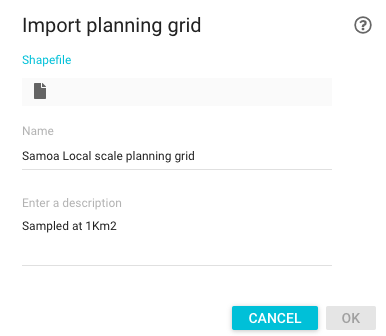

##### Creating new planning grids using Marxan Web 
To create a new planning grid in Marxan Web, click on the New button in the planning grids window. This opens the New Planning Grid window where you will need to select the necessary information to create the planning grid. For the area of interest, in future versions of Marxan Web you will be able to upload an area of interest which will define the geographic extent for the planning grid.  

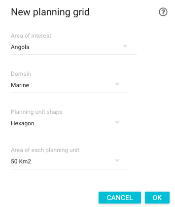

#### Exporting planning grids
Planning grids can be exported to a zipped shapefile using the Export button. This is useful for creating custom cost profiles. For more information see [ Creating a cost profile](#creating-a-cost-profile).  

#### Deleting planning grids
Deleting planning grids can only be done by admin users and should be done with great caution as those grids may be in use in any number of projects on that server. If they are deleted then the projects that reference them will no longer work correctly and it may not be possible to repair them.  

### The Planning Units tab
When a planning grid is used within a project, by default all of the planning units within the grid are used in the analysis with the same cost. If you want to change how these planning units are used, this is done through the Planning Units tab. This tab allows you to either manually include or exclude individual planning units, include all planning units which contain existing protected areas and to set custom costs for planning units. These are described in the sections below.  

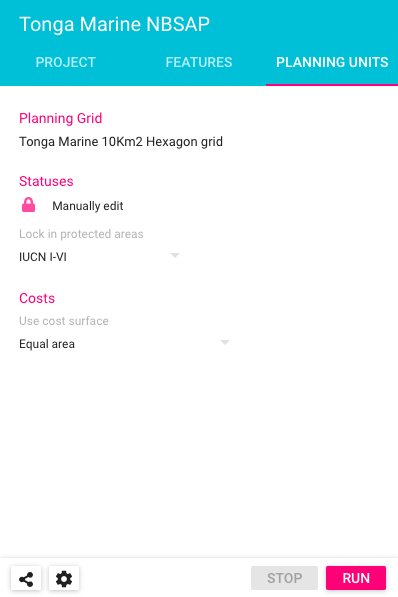

#### Understanding planning unit status and cost  
All planning units have two attributes that influence the results of a Marxan analysis: status and cost. The status of a planning unit determines whether it is included in every solution (i.e. locked in) or excluded (i.e. locked out). The default status is neither included or excluded but determined during the Marxan analysis. The cost of a planning unit is not a hard value that locks in/out a particular planning unit, but rather a weighting to subtely influence the results. 

#### Status
##### Manually including/excluding individual planning units
Manually including or excluding individual planning units is useful where a real-world issue affects where new protected areas can be designated. For example, if you know that a particular planning unit contains a restricted military area and cannot be designated, then you could manually exclude that planning unit from the project.  

If you want to manually include or exclude individual planning units from the project, then click on the lock icon. The planning units are now in edit mode (disabling the Project and Features tab), where you can change the status of any of the units to be one of the following: Default, locked in or locked out.  

To change the status of a planning unit, click on the map. The status will cycle between the three states. If you want to reset the status to the default then right click on the planning unit. If you want to reset all of your manual edits, click on the eraser button. The status of the planning unit is shown in the legend.  

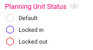

When you have finished editing the planning units, click on the save icon and the statuses will be saved. You can now run the project with these updated statuses. It is important to note that these changes to the planning units only appy to the current project and not to the planning grid itself. Creating a new project with the same planning grid will not show any of the manual changes that have been made.  

##### Including existing protected areas
Another method of changing the status of planning units, is to include all existing protected areas in the project. By including protected areas in the project you are ensuring that the existing protected areas network is part of your overall reserve design. See [Protected Areas information](#protected-areas-information) for information on the source of the protected areas data.  

To include existing protected areas in your project, select the appropriate IUCN protected areas category from the list. The 'All' category includes all IUCN Categories including the categories 'Not Reported', 'Not Assigned' and 'Not Applicable'. For more information on IUCN categories, see [Protected Area Categories](https://www.iucn.org/theme/protected-areas/about/protected-area-categories). The map will update to show the planning units that include protected areas with that particular IUCN category.  

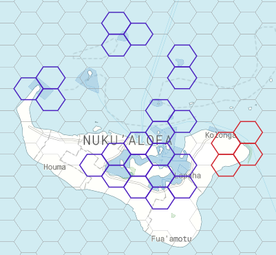

If this is the first time that the protected areas have been locked in, then preprocessing will need to be done on those protected area boundaries. For more information see [Preprocessing protected areas](#preprocessing-protected-areas).  

If you have already made some manual edits to the planning units and these overlap with the planning units that contain protected areas, then the manual edit will take precedence.  
#### Costs
By default all project in Marxan Web have an equal area cost surface which means that planning units with the same area have the same cost. All planning units created in Marxan Web are equal area and so by definition costs are equal. You can create your own cost surfaces and import them for use within Marxan Web - the cost value is show in the legend and can be queried using the identify tool (see [Identifying Planning Units](#identifying-planning-units)).

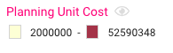

##### Creating a cost surface
Cost surfaces are specific to individual planning grids and the first step to creating a cost surface is to download the planning grid that you want to create a cost surface for. For more information see [Exporting planning grids](#exporting-planning-grids). Once you have downloaded and unzipped the planning grid shapefile create a .cost file that can be imported and used in Marxan Web. The following steps describe a generic workflow that should be followed in a desktop GIS package, e.g. ArcGIS or QGIS.  

- Add the planning grid shapefile to a map
- Add a field to the planning grid called cost
- Populate the cost field with whatever costs you want to use (based on your own analysis or intersections)
- Export the shapefile to a .csv text file with the extension .cost
- Ensure that the text file has a structure like the following:

```
id,cost
1,2000000
2,2000000
...
```

##### Importing a cost surface
To import and use a custom cost surface in Marxan Web use the following steps:

- In the Use Cost surface drop-down box, select Custom..  

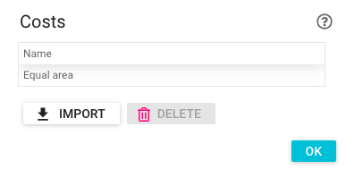

- In the Costs Window, click on Import.  
- In the Import Cost Surface window select the .cost file that you created  

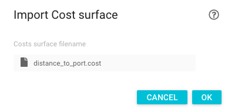

- Click OK to close the Import Cost Surface window and click OK to close the Costs window

You can now select and use the custom cost surface from the Cost surface drop-down box.  

#### Protected Areas information
Marxan Web uses protected areas information from the World Database of Protected Areas (WDPA) and the citation for the WDPA that is used is indicated in the Help | About window. The version of the WDPA that is in use depends on the version that is available in the Marxan Server and is shown in the Server Details window (see [Server Details](#server-details)) and at the bottom of the map (see also [Acknowledgements](#acknowledgements)). Future versions of Marxan Web will allow users to upload their own protected areas information if they want to be able to include protected areas that are not part of the WDPA, e.g. Other Effective Area-Based Conservation Measures such as Locally Managed Marine Areas.  

#### Preprocessing protected areas
Preprocessing of protected areas is necessary to see how they intersect with the planning units. This only needs to be done once and at the end of the process the planning units which intersect with the protected areas are shown with a blue border in the map. This indicates that they will be locked into the reserve network. The progress of this preprocessing can be seen in the Log tab. 

If the WDPA is updated with new data then the intersection analysis between the protected areas and the planning units will need to be repeated.  

## Users
### Understanding users
The Marxan Web tool is designed to support the design of new reserve systems and protected area networks that can be shared amongst a user community and some of that information may be sensitive or confidential. Therefore controlling access to that data and who can do what with it is a fundamental requirement of the tool.  

Marxan Web provides controlled access to resources through the use of Roles and every registered user belongs to a particular role. By default all new registered users belong to the 'user' role. Role management is done by users with an admin role through the Users window.  
Every user has access to their own profile and settings through the User menu which allows you to change overall settings for Marxan Web, change your personal information and your password. For more information see [The User menu](#the-user-menu).  

### The Users window (admin users only)
The Users window provides information on the users that are registered on the server and is available from the Admin menu. The table shows the following information: the username, the users full name and email and their current role. At the bottom of the Users window is a toolbar that allows you to manage Users. These tools are described in the following sections.  

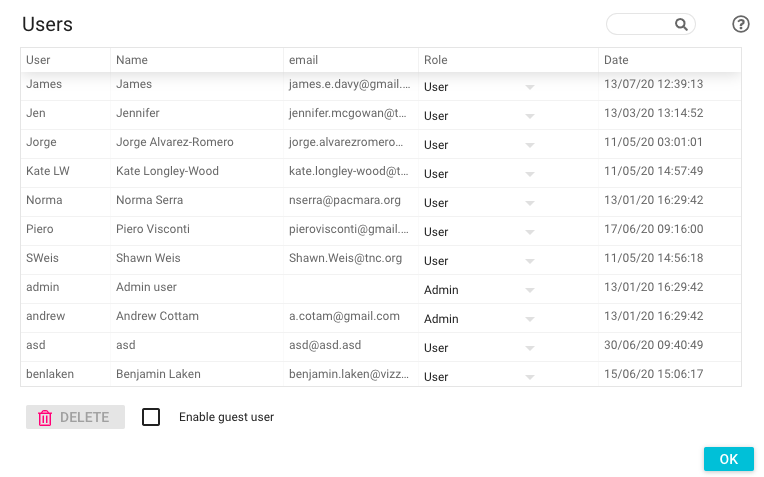

### Managing users
#### New User Registration
New users are registered with the New User Registration window accessible from the Login form and new users must provide their username, password, full name and an email address. If the username already exists on that server then they will receive an error message and will have to choose a different username. This user information can be changed at any time using the User menu. For more information see [The User menu](#the-user-menu).  

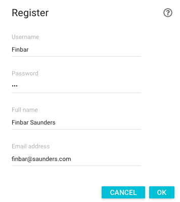

Currently registration is done automatically and users can immediately login with their credentials in the Login form.  

#### Deleting users (admin users only)
Users can be deleted from the Users window by admin users. To delete a user, select the user and click on the Delete button. This should be done with great caution as all of the associated projects for that user on that server will also be deleted.  

#### Enabling Guest Users (admin users only)
By default all servers provide read-only access to all projects through the Guest user. For more information see [Guest users](#guest-users). To enable/disable the Guest user tick/untick the checkbox at the bottom of the Users window.  

### Roles
This section describes the access that specific roles have to Marxan Web and the underlying data.  

#### Guest users
Guest users are users that have read-only access to all projects on the server (with the exception of projects which have been flagged as private, which they will not be able to see - for more information see [Controlling access to a project](#controlling-access-to-a-project)). As a read-only user they can view projects, features and grids but they will not be able to change any of them. For projects, they will be restricted to viewing the results of projects and changing how they are displayed on the map - no other settings can be changed for a project and they will not be able to run them either.  

The Guest user is enabled by default on servers so that you can view projects on other servers as a read-only user. This can be changed in the Users window. For more information see [Enabling Guest Users](#enabling-guest-users-admin-users-only). If the Guest user is disabled on a server then login attempts will fail.  

To log in as a guest user, use the user/password: guest/password.  

#### Users
The role 'User' is the default role for new registered users in Marxan Web. This role can create and manage projects, features and planning grids with some restrictions (they have no delete rights for any of these resources). In addition, the Projects window will only show projects belonging to that user (to make it easier for them to find their own projects on a server with lots of other users and projects). If a user wants to see all of the other projects on the server, regardless of user, then they can log in as the Guest user (with read-only access).  

#### Admin users
Admin users have the most privilages in Marxan Web and have full access to all features including managing users. Each server will have at least one admin user and this role is responsible for managing access for all of the other registered users. Administration of Marxan Web is covered in more detail in the [Administrator Documentation](admin.html).  

### The User menu
The User menu allows you to view and update information on the currently logged on user and to set general settings for Marxan Web. Click on the user name to show the User menu. The items in the menu are described in the following sections.  

#### User Settings 
The User Settings window provides access to general settings for the Marxan Web tool and these settings are saved between sessions.  

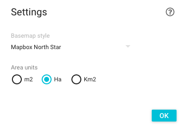

The Mapbox basemap style setting allows users to select their default basemap from a list including vector basemaps and imagery basemaps. For more information see [Changing the basemap](#changing-the-basemap).  

The Area Units setting controls how areal information is shown in Marxan Web, for example in the Feature Properties window or the Gap Analysis window.  

#### Profile
The Profile window allows users to update their profile information.  

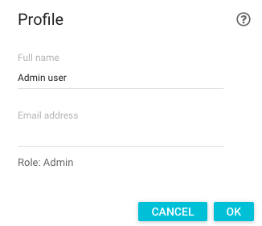

#### Change password
The Change password window allows users to update their password. Users will have to use this new password the next time they log into Marxan Web.  


#### Logout
Logs a user out of the Marxan Server.    

## Mapping
### Understanding mapping
One of the main aims in the design of Marxan Web has been to be able to view the results of any analyses quickly and easily on a map. In the DOS version of Marxan there was no mapping interface built in and users had to use a variety of tools to be able to visualise the results. The most advanced tool for visualising Marxan results is the CLUZ tool which is a plugin for the QGIS desktop GIS software - for more information see the [CLUZ website](https://anotherbobsmith.wordpress.com/software/cluz/). Marxan Web builds on the mapping features of CLUZ but from within a web browser where results can be accessed and shared without any additional software requirements.  

The main features of the mapping components in Marxan web are:
- High performance visualising of hundreds of thousands of planning units  
- On-the-fly changes to the symbols and rendering  
- A range of different basemaps available all with Open Street Map content  
- Rotation and tilting of the map (including rotating labels)
- Low bandwith for the data

In order to meet these requirements a technology called MapboxGL has been used and Marxan Web benefits from in-kind contributions from Mapbox - for more information see [Acknowledgements](#acknowledgements). These include access to a number of global Open Stree Map basemaps - for more information see [Changing the basemap](#changing-the-basemap).  

The main mapping features are described in the following sections.  

### Interacting with the map
The interactive map supports all of the usual web map features such as panning, zooming and navigating but it also supports rotating and tilting the map view as well. To rotate or tilt the map view, right-click on the map and move the mouse up/down to tilt or left/right to rotate the map. To reset the rotation, click the compass icon in the bottom right of the map window. To reset the extent of the map back to the extent of the project, click the square icon above the zoom in/out buttons.  

When the results of a Marxan run are shown in the map, users can click on planning units to see a list of all of the features that occur in that particular planning unit. 

### Identifying items on the map
Like traditional GIS systems the map also allows the identification of items by clicking on the map. The identify window shows the resulting items from the planning grid layer, protected area layer and feature layers. 

#### Identifying Planning Units
The identify planning units window summarises the metadata about the planning unit (including the type of planning unit and its cost) and the features and their areas that occur within that planning unit.  


#### Identifying Protected areas
The identify protected areas window shows a list of all of the protected areas that occur at that point and information on the designation, IUCN category and a link to their page on the protectedplanet website.  


#### Identifying Features
The identify features window shows a list of features that occur at that point that are currently visible on the map.  


### Changing how the results are displayed
The display of the results in the map can be configured using the Classification window, accessible from the gear icon in the Results on the Legend tab. This window allows you to set the classification method that is used to color the various planning units in the results. At the top of the classification window is a frequency histogram which shows the distribution of the summed solutions and their frequency. For more information about the summed solutions see [Understanding the summary of solutions](#understanding-the-summary-of-solutions). To change how the sum of solutions are symbolised, change any of the parameters in the Classification window to immediately see the results. Once you are satisfied with the symbols click OK. These settings are saved with the project and will be reloaded when the project is reloaded. 


### Changing transparency of layer
To change the transparency of layers in the map, click on the slider in the legend and move it to the right (more opaque) or the left (more transparent). To show/hide the layer click on the eye icon.  


### Changing the basemap
The basemaps that are used in Marxan Web include both traditional vector cartography and high resolution imagery. The vector data is provided by Open Street Map (OSM) which is a community-driven public dataset of the worlds geographic features. In many parts of the world it offers unrivalled detail on a whole range of geographic features which are updated on a rolling basis (including down to the street and house level). For more information see [OpenStreetMap](https://www.openstreetmap.org/). The imagery data comes from a variety of commercial providers, as well as open data from NASA, USGS, and others. For more information see [Mapbox Sources](https://www.mapbox.com/about/maps/#data-sources).  

To change the basemap, select one from the list in the User Settings. For more information see [User settings](#user-settings).  

### Requirements for importing spatial data  
Any spatial data imported into Marxan Web must have the necessary projection information file present (a *.prj file in a shapefile) so that the feature can be projected internally to an equal area projection. This internal reprojection is necessary so that spatial operations can be done (e.g. intersection) and so that Marxan can run using the data.  

In addition, spatial data needs to be topologically valid to be used within Marxan Web. This essentially means that the polygon must conform to a set of rules regarding its shape, the location of its vertices and how they relate to each other. Different software tools have different rules for validating the topology of polygons and Marxan Web uses the PostGIS rules (as it uses the PostGIS database internally for managing and analysing spatial data). If the spatial data does not conform to these rules then it will not be imported as it is likely to fail any overlay analysis. For more information on how to repair invalid geometries, see [here](https://postgis.net/workshops/postgis-intro/validity.html).  

### Uploading spatial data to Mapbox
Any spatial data that is imported into Marxan Web is stored in a database on the server and it is also uploaded to Mapbox to make the high performance visualisation possible. This process is done when the data are first uploaded and once this has finished it does not need to be done again. The process should not take more than 1-2 minutes and you can continue using Marxan Web while the process is ongoing.  

## Tools and analyses
The tools and analyses menu contains additional analytical and administrative tools for working with Marxan Web. The specific items that are shown will depend on the users role and whether the current project is a Marxan Web project or an imported project. The image below shows all of the available tools which are described in the following sections.   


### Users (admin users only)
See [The Users window](#the-users-window).  

### Run Log
See [the Run log](#the-run-log).

### Reset (admin users only)
Reset is an administrative tool designed for Marxan Web trainers to reset the Marxan Server instance back to its default state. For example, if a training session is being run and all of the users and their projects from a previous training sessions want to be removed, the reset tool can be used. This is only available where the Marxan Server instance has enabled it. For more information see the [Administrator Documentation](admin.html).  

### Gap analysis window


The gap analysis window shows the results of a gap analyis using the features and targets from the current project (using the method outlined in [Rodriguez <i>et al</i>, 2004](#references)). A gap analysis calculates how much of each feature is protected within the existing protected area network and then summarises the representation as a score. The calculation is based on combining the protected areas into a single layer where there are no overlaps (i.e. dissolving the protected area boundaries) - this dissolving is based on a filtered set of protected areas which excludes the following:
- The status is not 'Proposed' or 'Not reported'
- The designation is not 'World Heritage Site (natural or mixed)' or 'Biosphere Reserve'
- Protected areas that are represented as points - although these have an attribute for the area, there is no way of knowing where they are and so any gap analysis based on these would be higher uncertainty.  

The features that occur within the country are then intersected with this dissolved protected area layer to find the area that is protected. The representation score is a measure of the overall success if achieving representation and is calculated according to the Mean target achievement given in [Jantke <i>et al</i>, 2019](#references).  

The Gap Analysis can also be shown as a chart as in the following screenshot.    


### Cleanup server (admin users only)
Cleanup server is another administrative tool to clean up resources on the server that may have been created and are no longer required.  

## Reports and outputs
Future versions of Marxan Web will have features to produce a downloadable report which presents information on the project, features, targets and shows the map results.  

GIS users can directly connect to the database of a local installation of Marxan Web and produce their own maps and reports by combining this Marxan data with their own local data layers. For more information see the [Developer Documentation](dev.html).  

## Server Details
The Server Details show the information about the server that the user is currently connected to, including the server name, description, host, operating system, version of the marxan-server and the version of the World Database of Protected Areas. To access the Server Details window, click on the server name in the toolbar.  

  

For Admin users, if there is a new version of the WDPA available then they will be able to update it from this window. For information on updates to the WDPA see [here](https://www.protectedplanet.net/c/monthly-updates){:target="_blank"}. If the WDPA is updated with new data then the intersection analysis between the protected areas and the planning units will need to be repeated.  

## Filtering items
At the top of the windows for projects, features and planning grids is a filter box that allows the user to filter the items by matching or non-matching text. To filter the items simply enter any text string in the box and items are shown according to any columns that match the text string. To filter on non-matching text, enter an exclamation mark before the search text.  

## Help menu
The Help menu provides simple information on the server, a link to the documentation and an About box. These are described in the following sections.  

### Documentation
This provides a link to the main page for the Marxan Web documentation.  

### About window
The About window provides information on the versions of software that are being used including the underlying DOS version of Marxan. It also provides information on data providers and funding and in-kind contributions. 


## References  
Jantke, K, Kuempel, CD, McGowan, J, Chauvenet, ALM, Possingham, HP. <i>Metrics for evaluating representation target achievement in protected area networks. Divers Distrib</i>. 2019; 25: 170 175. [https://doi.org/10.1111/ddi.12853](https://doi.org/10.1111/ddi.12853){:target="_blank"}

Rodrigues, Ana & Akcakaya, H. Resit & Andelman, Sandy & Bakarr, Mohamed & Boitani, Luigi & Brooks, Thomas & Chanson, Janice & Fishpool, Lincoln & Fonseca, Gustavo & Gaston, Kevin & Hoffmann, Michael & Marquet, Pablo & Pilgrim, John & Pressey, Robert & Schipper, Jan & Sechrest, Wes & Stuart, Simon & Underhill, Leslie & Waller, Robert & Xie, Yan. (2004). <i>Global Gap Analysis: Priority Regions for Expanding the Global Protected-Area Network</i>. BioScience. 54. 10.1641/0006-3568(2004)054[1092:GGAPRF]2.0.CO;2. 

Harris J, Mirande C, editors. 2019 Crane Conservation Strategy. International Crane Foundation, Baraboo, Wisconsin.  

## Providing Feedback
Please provide any feature requests or bug reports to the [GitHub repo](https://github.com/marxanweb/marxan-web) by creating a new issue.  

To create a new issue:  
- Login to GitHub and click on the Issues tab and click New Issue


- Create the new issue and attach a label of Bug (for a bug) or Enhancement (for a feature request).


For general feedback, please email andrew.cottam@ec.europa.eu.

## Acknowledgements
### Data providers  

Uses data from the World Database of Protected Areas. IUCN and UNEP-WCMC (2017), The World Database on Protected Areas (WDPA) August 2017, Cambridge, UK: UNEP-WCMC. Available at: www.protectedplanet.net  

### Funding and in-kind contributions:  
Marxan Web funded by the BIOPAMA project of the European Commission. With in-kind contributions from Mapbox.  

Marxan funded by a range of donors - see [here](http://marxan.org/credits.html).

## FAQ
### Why do imported projects have less functions available?
Projects that have been imported from the DOS version of Marxan only contain text files with data in. These files were taken directly from the Marxan project input and output folders and do not contain the original spatial data that was used to create all of the necessary tabular input files. Therefore, because there is no spatial data available for any of the features, they cannot be shown on the map pr added/removed from projects in the same way that new projects created with Marxan Web can be.   

